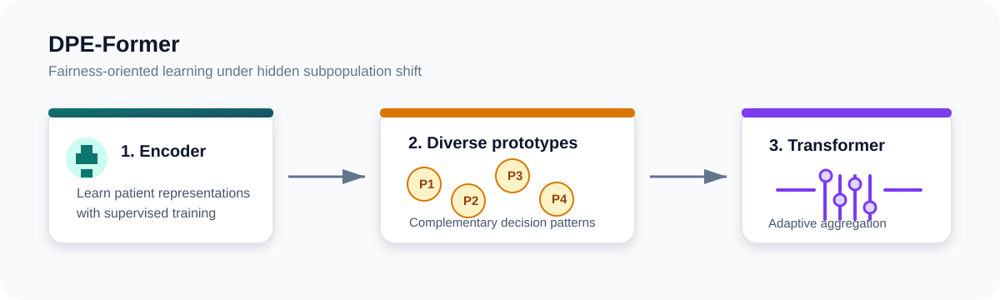

# Shift Happens: DPE-Former for fair medical classification

[](https://doi.org/10.1007/s11548-026-03624-0)
[](https://www.python.org/)
[](https://pytorch.org/)

Official research code for **DPE-Former**, a fairness-oriented framework for medical classification under hidden bias. The method learns a diverse ensemble of prototype classifiers and uses a transformer to adaptively aggregate their predictions. It is designed for settings where clinically relevant subgroups are latent, incompletely annotated, or unavailable during training.

> **Paper:** [*Shift Happens: A Fairness-Oriented Framework for Medical Classification under Hidden Bias*](https://doi.org/10.1007/s11548-026-03624-0), *International Journal of Computer Assisted Radiology and Surgery* (IJCARS), 2026.

<p align="center">
  
</p>

## Overview

Standard empirical-risk minimization can yield strong aggregate performance while failing for patients from underrepresented acquisition sites, demographics, or other hidden subpopulations. DPE-Former addresses this with three stages:

1. **Feature extraction:** train an encoder using standard supervised learning.
2. **Diverse prototypical ensemble:** learn complementary prototype heads on balanced subsets, encouraging coverage of latent population variation.
3. **Transformer aggregation:** attend across the prototype predictions to produce an adaptive final prediction.

The paper evaluates the approach on prostate ultrasound, dermoscopy, and cardiac tabular data. It reports more consistent performance across underrepresented groups than the comparison methods considered in the study.

## Repository layout

```text
faimi2025/                 DPE-Former training pipeline and SLURM launchers
  main.py                  two-stage prototype + transformer experiment entry point
  scripts/                 dataset-specific launch configurations
  utils/                   data loading, metrics, models, and training utilities
main_v1.py                 earlier image-model training pipeline
utils/                     shared utilities used by the legacy pipeline
assets/                    architecture illustration and affiliation marks
```

`faimi2025/` is the recommended entry point for the DPE-Former experiments. `main_v1.py` is retained for the earlier image-training workflow and checkpoint/feature preparation.

## Setup

The code uses `match` statements and therefore requires **Python 3.10 or newer**. A CUDA-enabled PyTorch installation is recommended for the full experiments.

```bash
git clone https://github.com/minhto2802/prototypical-ensemble-med.git
cd prototypical-ensemble-med

python -m venv .venv
source .venv/bin/activate
pip install --upgrade pip
pip install -r requirements.txt
```

Install the PyTorch build appropriate for your CUDA runtime if the default wheel is not suitable; see the [PyTorch installation guide](https://pytorch.org/get-started/locally/).

## Data and expected inputs

No patient data or pretrained checkpoints are distributed in this repository. Prepare data in accordance with the governing dataset licenses, ethics approvals, and institutional policies.

For the feature-based DPE-Former entry point, `--data_dir` should contain the pre-extracted split features and `--metadata_path` should point to the corresponding CSV:

```text
data_dir/
  feats_tr.npy             # optional, depending on the selected train split
  feats_va.npy
  feats_te.npy
metadata.csv               # includes split, filename, y, a, and optionally g columns
```

The included launchers use validation features as the prototype-training split (`--dpe.trn_split va`). This follows the experiment configuration in the repository. Keep patient-level splits intact and do not use protected or clinical attributes beyond what is authorized for the study.

## Running DPE-Former

Run from `faimi2025/` so its local `utils` package is resolved:

```bash
cd faimi2025

python main.py \
  --db true \
  --data_dir /path/to/embeddings/ham10k \
  --metadata_path /path/to/embeddings/ham10k/metadata.csv \
  --dpe.dataset_name Features \
  --dpe.emb_dim 2048 \
  --dpe.num_stages 11 \
  --dpe.epochs 20 \
  --t.epochs 200 \
  --t.d_model 128 \
  --t.ff_dim 512
```

`--db true` uses the repository's no-op tracking run for local debugging. Omit it to log to Weights & Biases. The scripts in [`faimi2025/scripts`](faimi2025/scripts) are SLURM templates for the HAM10000, BK, and tabular experiments; review paths, accounts, GPU resources, and tracking group names before submitting a job.

## Reproducibility notes

- Set `--seed` to control Python, NumPy, and PyTorch random seeds.
- Persist the feature extractor checkpoint and generated `feats_*.npy` files with each run.
- Report overall, balanced, and worst-group accuracy together; aggregate accuracy alone can obscure subgroup failures.
- Run on de-identified data only and avoid interpreting model outputs as clinical recommendations.

## Citation

```bibtex
@article{to2026shifthappens,
  title   = {Shift Happens: A Fairness-Oriented Framework for Medical Classification under Hidden Bias},
  author  = {To, Minh Nguyen Nhat and Kim, Diane and Harmanani, Mohamed and Wilson, Paul F. R. and Fooladgar, Fahimeh and others},
  journal = {International Journal of Computer Assisted Radiology and Surgery},
  year    = {2026},
  doi     = {10.1007/s11548-026-03624-0}
}
```

## Affiliations

<p align="center">
  <a href="https://www.ubc.ca/"></a>
  <a href="https://www.queensu.ca/"></a>
  <a href="https://www.vch.ca/locations-services/vancouver-general-hospital"></a>
  <a href="https://www.utoronto.ca/"></a>
</p>

The affiliation marks above are compact, project-local wordmarks created for this repository; institutional names and marks remain the property of their respective organizations.

## Acknowledgements

This work was supported in part by CIHR and NSERC. Data were provided with appropriate ethical permissions. Please see the paper for the full ethics, funding, and disclosure statements.
