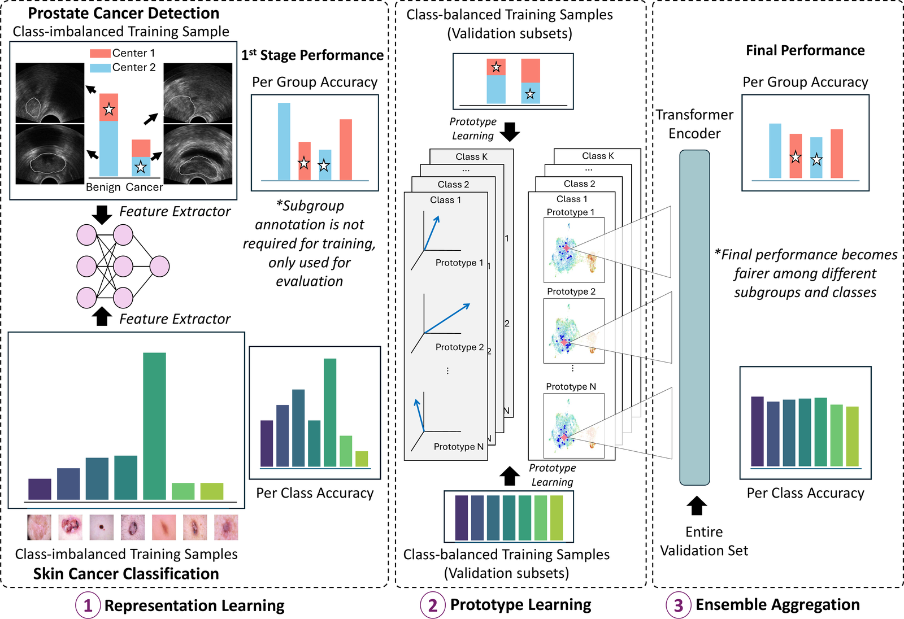
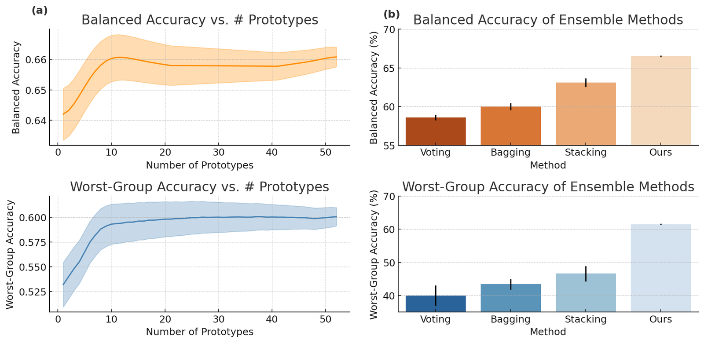

<div align="center">

# Shift Happens

### A fairness-oriented framework for medical classification under hidden bias

[](https://doi.org/10.1007/s11548-026-03624-0)
[](https://www.python.org/)
[](https://pytorch.org/)

**DPE-Former learns complementary prototype classifiers and lets attention decide how to combine them—without requiring subgroup labels during training.**

[Paper](https://doi.org/10.1007/s11548-026-03624-0) · [Project page](https://minhto2802.github.io/posts/shift-happens.html) · [Results](#results) · [Quick start](#quick-start) · [Citation](#citation)

<sub>Minh Nguyen Nhat To, Diane Kim, Mohamed Harmanani, Paul F. R. Wilson, Fahimeh Fooladgar, Samira Sojoudi, Amoon Jamzad, Sherif Abdalla, Teresa Tsang, Christina Luong, Silvia Chang, Peter Black, Robert Siemens, Michael Leveridge, Rahul G. Krishnan, Parvin Mousavi, Purang Abolmaesumi</sub>

<sub><i>International Journal of Computer Assisted Radiology and Surgery</i> <b>21</b>, 1025–1032 (2026)</sub>

</div>

<br>

<p align="center">
  
</p>

<p align="center"><sub>Figure from the paper: DPE-Former moves from a standard feature extractor to diverse class prototypes, then aggregates their predictions with a transformer encoder.</sub></p>

---

## The problem

A medical classifier can look strong on average and still fail systematically for patients from a particular hospital, scanner, demographic, or acquisition protocol. These groups are often hidden, incomplete, or unavailable when the model is trained.

DPE-Former is built for that setting. It seeks more consistent performance across latent subpopulations while preserving strong overall classification performance.

## How DPE-Former works

| 01 — Represent | 02 — Diversify | 03 — Attend |
| :--- | :--- | :--- |
| Train a supervised encoder and extract patient-level embeddings. | Learn multiple prototype heads on balanced subsets so each can capture a different decision pattern. | Use a transformer to model relationships between prototype predictions and produce an adaptive final decision. |

The result is a group-unaware training strategy: subgroup annotations are used for evaluation, not required as training supervision.

## Evaluation domains

| Domain | Modality | Hidden shift studied |
| :--- | :--- | :--- |
| Prostate cancer detection | Ultrasound | Clinical centre and acquisition differences |
| Skin-lesion classification | Dermoscopy | Class, visual, and demographic imbalance |
| Acute coronary syndrome treatment | Clinical tabular data | Latent treatment subgroups |

> [!IMPORTANT]
> This is research software, not a medical device. Do not use model outputs for diagnosis or treatment decisions without independent clinical validation, governance, and regulatory review.

## Results

All values in per cent, averaged over three random seeds, with early stopping on validation worst-group accuracy. **ACC** is overall accuracy, **BA** is balanced accuracy averaged over classes, and **WGA** is worst-group accuracy — the lowest-scoring subgroup.

| Method | Prostate US<br>ACC | Prostate US<br>BA | Prostate US<br>WGA | HAM10000<br>ACC | HAM10000<br>BA | HAM10000<br>WGA | Cardiac<br>ACC | Cardiac<br>BA | Cardiac<br>WGA |
| :--- | ---: | ---: | ---: | ---: | ---: | ---: | ---: | ---: | ---: |
| ERM | — | — | — | 78.4 | 80.1 | 66.7 | 62.0 | 60.7 | 35.7 |
| MedSAM | **75.4** | 66.1 | 38.1 | — | — | — | — | — | — |
| Cinepro | 74.5 | 64.3 | 38.1 | — | — | — | — | — | — |
| DFR | 66.7 | 63.8 | 50.3 | 81.0 | **84.0** | 72.5 | 67.9 | 71.6 | 38.1 |
| DPE | 66.3 | 65.7 | 58.7 | 80.4 | 83.5 | 75.3 | 67.5 | 68.8 | 42.9 |
| **DPE-Former** | 66.1 | **66.3** | **60.2** | **82.9** | 83.6 | **75.6** | **68.6** | **73.1** | **62.5** |

Bold marks the best value in each column. Em dashes mark configurations that are not reported: MedSAM and Cinepro are ultrasound-specific, and ERM is not listed separately for prostate ultrasound because the MedSAM and Cinepro rows are themselves ERM classifiers trained on features from their respective encoders.

DPE-Former achieves the best worst-group accuracy on all three datasets while remaining competitive on balanced accuracy. The margin is largest on the cardiac tabular data, where it reaches 62.5% WGA against 42.9% for DPE and 38.1% for DFR, and simultaneously records the highest balanced accuracy at 73.1%.

### Ablations

<p align="center">
  
</p>

<p align="center"><sub>Ablations on prostate ultrasound. (a) Effect of the number of prototypes. (b) Comparison of aggregation strategies. Each experiment is repeated three times.</sub></p>

- **Diversity helps, then saturates.** Balanced accuracy rises from about 64% with two prototypes to roughly 66% at around six, then holds steady out to fifty. Worst-group accuracy follows the same shape, climbing from roughly 53% to just above 60%.
- **Learned aggregation beats fixed rules.** Voting, bagging, and stacking reach roughly 58%, 60%, and 63% balanced accuracy, with worst-group accuracy below 50% in each case. The transformer aggregator reaches about 67% balanced and 61% worst-group accuracy in the same setting.
- **Subgroup labels are not the deciding factor.** On the cardiac data, GroupDRO — which does see subgroup labels during training — records 66.5 ± 2.1% ACC, 65.4 ± 2.5% BA, and 47.6 ± 6.1% WGA, below DPE-Former on all three despite the extra supervision.

### Experimental setup

Encoders are dataset-specific: a fully fine-tuned MedSAM-based model with biopsy-level supervision for prostate ultrasound, ImageNet-pretrained ResNet-50 for HAM10000, and TabPFN embeddings for the cardiac tabular data. Prototype classifiers and the transformer aggregator are trained with Adam at a learning rate of 1e-4 and batch size 64, for up to 100 epochs with early stopping on validation WGA. Hyperparameters are selected on a stratified validation subset, and all reported metrics come from held-out test patients with no overlap across splits.

### Limitations

- Balanced and worst-group accuracy show whether accuracy is even across groups, but not which kinds of error occur within each group.
- The transformer models prototype interactions effectively, but its decisions remain hard to interpret.
- Evaluation covers datasets with known subgroup variability; larger, more heterogeneous cohorts with overlapping subgroup structure may behave differently.
- The aggregator architecture was chosen for stable optimisation rather than exhaustive search.

## Quick start

### 1. Create an environment

The code uses Python pattern matching and requires **Python 3.10 or newer**. A CUDA-enabled PyTorch installation is recommended for the full experiments.

```bash
git clone https://github.com/minhto2802/prototypical-ensemble-med.git
cd prototypical-ensemble-med

python -m venv .venv
source .venv/bin/activate
python -m pip install --upgrade pip
pip install -r requirements.txt
```

If needed, install the PyTorch build matching your CUDA runtime from the [official installation guide](https://pytorch.org/get-started/locally/).

### 2. Prepare features

Patient data and pretrained checkpoints are not distributed in this repository. The feature-based pipeline expects:

```text
embeddings/my_dataset/
├── feats_tr.npy           # optional when another split is used for training
├── feats_va.npy
├── feats_te.npy
└── metadata.csv           # split, filename, y, a, and optionally g
```

Preserve patient-level splits and follow the dataset's ethics approval, data-use agreement, and institutional policy.

### 3. Run an experiment

Run the DPE-Former pipeline from `faimi2025/` so its local utilities resolve correctly:

```bash
cd faimi2025

python main.py \
  --db true \
  --data_dir /path/to/embeddings/ham10k \
  --metadata_path /path/to/embeddings/ham10k/metadata.csv \
  --dpe.dataset_name Features \
  --dpe.emb_dim 2048 \
  --dpe.num_stages 11 \
  --dpe.epochs 20 \
  --t.epochs 200 \
  --t.d_model 128 \
  --t.ff_dim 512
```

`--db true` selects the no-op logger for local debugging. Omit it to log with Weights & Biases. Dataset-specific SLURM templates are available in [`faimi2025/scripts`](faimi2025/scripts); review paths, accounts, GPU resources, and run names before submission.

## Repository map

```text
.
├── faimi2025/
│   ├── main.py            # recommended DPE-Former entry point
│   ├── scripts/           # dataset-specific SLURM launchers
│   └── utils/             # models, datasets, metrics, and training loops
├── main_v1.py             # earlier image-model training pipeline
├── utils/                 # utilities used by the earlier pipeline
└── assets/                # paper figures and authentic affiliation marks
```

## Reproducibility checklist

- Fix `--seed` for Python, NumPy, and PyTorch.
- Version the feature-extractor checkpoint with each `feats_*.npy` set.
- Keep patient-level train, validation, and test partitions fixed.
- Report overall accuracy, balanced accuracy, and worst-group accuracy together.
- Record the metadata schema and the precise meaning of every evaluation group.

## Citation

To, M. N. N., Kim, D., Harmanani, M. et al. Shift happens: a fairness-oriented framework for medical classification under hidden bias. *Int J CARS* **21**, 1025–1032 (2026).

```bibtex
@article{to2026shifthappens,
  title   = {Shift happens: a fairness-oriented framework for
             medical classification under hidden bias},
  author  = {To, Minh Nguyen Nhat and Kim, Diane and
             Harmanani, Mohamed and Wilson, Paul F. R. and
             Fooladgar, Fahimeh and Sojoudi, Samira and
             Jamzad, Amoon and Abdalla, Sherif and
             Tsang, Teresa and Luong, Christina and
             Chang, Silvia and Black, Peter and
             Siemens, Robert and Leveridge, Michael and
             Krishnan, Rahul G. and Mousavi, Parvin and
             Abolmaesumi, Purang},
  journal = {International Journal of Computer Assisted
             Radiology and Surgery},
  volume  = {21},
  number  = {5},
  pages   = {1025--1032},
  year    = {2026},
  doi     = {10.1007/s11548-026-03624-0}
}
```

## Affiliations

<table>
  <tr>
    <td align="center" width="25%"><a href="https://www.ubc.ca/"></a></td>
    <td align="center" width="25%"><a href="https://www.queensu.ca/"></a></td>
    <td align="center" width="25%"><a href="https://www.vch.ca/en/location/vancouver-general-hospital"></a></td>
    <td align="center" width="25%"><a href="https://www.utoronto.ca/"></a></td>
  </tr>
  <tr>
    <td align="center"><sub>University of British Columbia</sub></td>
    <td align="center"><sub>Queen's University</sub></td>
    <td align="center"><sub>Vancouver General Hospital</sub></td>
    <td align="center"><sub>University of Toronto</sub></td>
  </tr>
</table>

Logo provenance and reuse notes are documented in [`assets/affiliations/README.md`](assets/affiliations/README.md). Institutional names and marks remain the property of their respective organizations; their appearance here does not imply endorsement.

## Acknowledgements

This work was supported in part by CIHR and NSERC. Data were provided with appropriate ethical permissions. See the paper for the complete ethics, funding, author-contribution, and disclosure statements.
